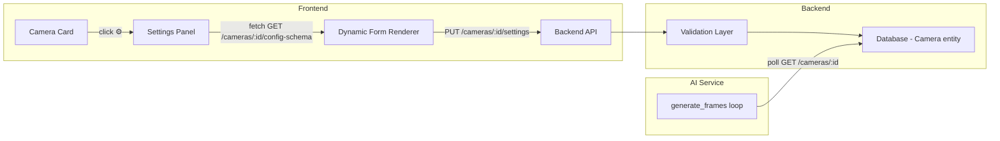

# Per-Camera Configuration System — Implementation Plan

## Overview
Add a per-camera AI configuration system where each camera has its own settings panel in the dashboard UI. The system dynamically discovers all configurable parameters from the backend (rather than hardcoding), validates and persists changes, and applies them immediately to the correct camera's AI inference pipeline.

## Architecture

## Changes by Layer

### 1. Backend — Config Schema Endpoint
**New file:** `backend/src/config/cameraConfigSchema.js`
- Defines a registry of all configurable AI parameters with metadata (key, label, type, default, min, max, description, category)
- Single source of truth — adding a new param here auto-surfaces it in the UI

**Modified:** `backend/src/controllers/camera.controller.js`
- Add `getConfigSchema` controller that returns the schema registry
- Enhance `updateSettings` to validate incoming values against the schema (type checks, range checks)

**Modified:** `backend/src/services/camera.service.js`
- Add `getConfigSchema()` service function
- Enhance `updateCameraSettings` with schema-aware validation

**Modified:** `backend/src/routes/camera.routes.js`
- Add `GET /:id/config-schema` route

### 2. Backend — Camera Entity Update
**Modified:** `backend/src/entities/Camera.js`
- Add new configurable columns: `confidenceThreshold` (float), `cooldownSeconds` (int), `alertsEnabled` (boolean), `intrusionEnabled` (boolean), `crowdEnabled` (boolean)
- TypeORM's `synchronize: true` will auto-migrate

### 3. AI Service — Dynamic Config Reload
**Modified:** `ai/main.py`
- Move config fetching inside the frame loop with a periodic refresh (every N seconds)
- Use the new per-camera fields (confidenceThreshold, cooldownSeconds, alertsEnabled, etc.)
- Each camera's inference uses only its own settings

### 4. Frontend — Camera Settings Panel
**Modified:** `frontend/src/Dashboard.jsx`
- Add a settings panel (slide-out or inline) that opens when clicking a ⚙️ gear icon on a camera card
- On open, fetch the config schema + current camera values
- Dynamically render form controls based on schema type (number → slider/input, boolean → toggle, time → time picker, etc.)
- On save, PUT to `/cameras/:id/settings`, validate response, update local state
- Add success/error toast feedback

**Modified:** `frontend/src/Dashboard.css`
- Styles for the settings panel, form controls, toggles, sliders, and animations

## Configurable Parameters (initial set)

| Key | Label | Type | Default | Constraints |
|-----|-------|------|---------|-------------|
| `crowdThreshold` | Crowd Alert Threshold | integer | 3 | min: 1, max: 100 |
| `confidenceThreshold` | AI Confidence Threshold | float | 0.5 | min: 0.1, max: 1.0, step: 0.05 |
| `cooldownSeconds` | Alert Cooldown (seconds) | integer | 10 | min: 1, max: 300 |
| `alertsEnabled` | Enable Alerts | boolean | true | — |
| `intrusionEnabled` | Intrusion Detection | boolean | true | — |
| `crowdEnabled` | Crowd Detection | boolean | true | — |
| `restrictedStartTime` | Restricted Zone Start | time | null | HH:MM:SS |
| `restrictedEndTime` | Restricted Zone End | time | null | HH:MM:SS |

## Key Design Decisions
1. **Schema-driven UI**: The frontend fetches a config schema from the backend, so adding new parameters requires only updating the schema registry — zero frontend changes
2. **Per-camera isolation**: Each camera has its own DB columns for all settings; changes to one camera never affect another
3. **Periodic hot-reload in AI**: The AI service re-fetches config every 30 seconds, so settings changes take effect without restarting the stream
4. **Backward compatible**: All new columns have defaults, existing cameras continue working unchanged
